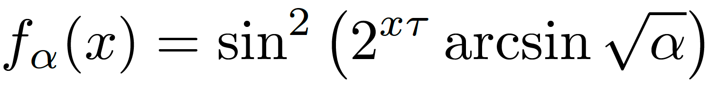
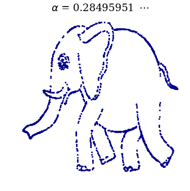
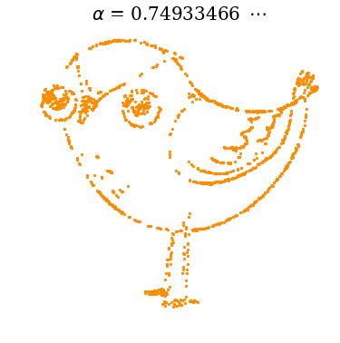
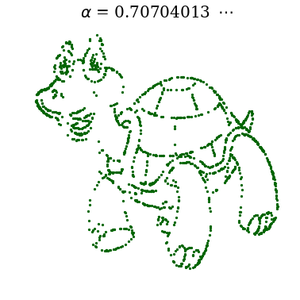
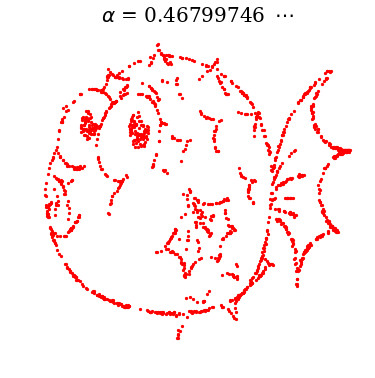
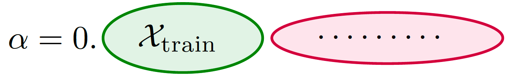
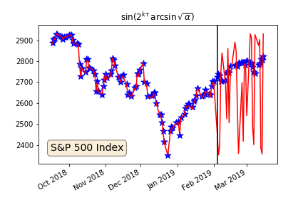
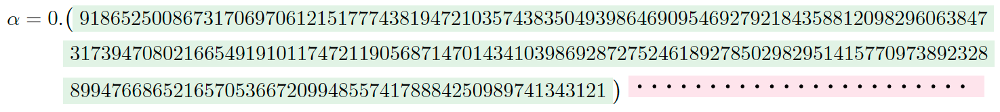

### Real numbers, data science and chaos: How to fit any dataset with a single parameter
##### *All details and more examples can be found in the accompanying [arXiv:1904.12320](https://arxiv.org/abs/1904.12320) paper (also hosted [here](1904.12320.pdf)).*

We show how any dataset of any modality (time-series, images, sound...) can be approximated by a well-behaved 
(continuous, differentiable...) scalar function with a single real-valued parameter:

Building upon elementary concepts from chaos theory, we adopt a pedagogical approach demonstrating how to adjust
this parameter in order to achieve arbitrary precision fit to all samples of the data.
Targeting an audience of data scientists with a taste for the curious and unusual, the results presented here
expand on previous similar observations regarding expressiveness power and generalization of machine learning models.

As a real number, the parameter &alpha; is non-terminating and its capacity to encode an infinite amount of information is used to translate any arbitrary dataset into
a single numerical value.

As such, there is no reason to expect this model to provide any kind of generalization to data outside of its training samples as demonstrated by the time series below:

